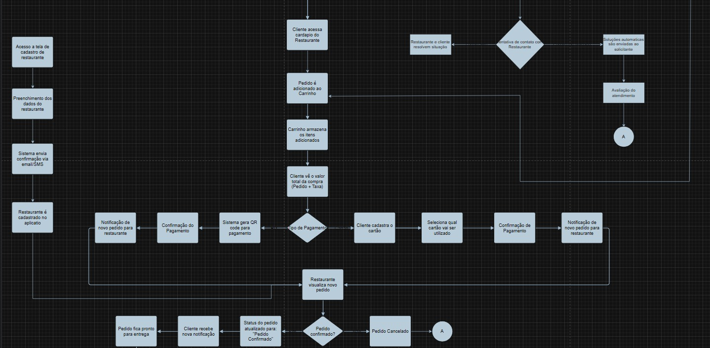

<p align="center" >
  <a href="https://github.com/pedrosdutra/softwaredelivery">
    
  </a>
</p>

<div align="center">
  <h1> Foodly </h1>
  <p>
  <a href="https://github.com/pedrosdutra/softwaredelivery/issues/new?assignees=&labels=bug&template=01_BUG_REPORT.md&title=bug%3A+">Reportar Bugs</a>
  ·
  <a href="https://github.com/pedrosdutra/softwaredelivery/issues/new?assignees=&labels=enhancement&template=02_FEATURE_REQUEST.md&title=feat%3A+">Pedir novas Features</a>
  ·
  <a href="https://github.com/pedrosdutra/softwaredelivery/issues/new?assignees=&labels=question&template=04_SUPPORT_QUESTION.md&title=support%3A+">Perguntar</a>
  </p>
</div>


<p align="center">
  <a href="#-colaboradores-">
    
    </a>
  </p>

<div align="center">

[](LICENSE)

[](https://github.com/sal0minh0/softwaredelivery/issues?q=is%3Aissue+is%3Aopen+label%3A%22help+wanted%22)
[](https://github.com/pedrosdutra/softwaredelivery)

</div>


<br>

<details open="open">
<summary>Sumário</summary>

- [Feito com](#✏️-feito-com)
- [Sobre](#ℹ️-sobre)
  - Cargos
  - Screenshots
- [Começando](#↪️-começando)
  - Pré-requisitos
- [Instalação Local](#🖥️-instalação-local)
- [Como usar](#❓️-como-usar)
- [Requisitos para a Entrega Final](#❗️-requisitos-para-a-entrega-final)
- [Como Contribuir](#🧑‍💻-como-contribuir)
- [Segurança](🔒️-segurança)
- [Licença](#🪪-Licença)

</details>

## ✏️ Feito com

<p align="center">
  <a href="#-shields-">
      &hairsp;
     &hairsp;
     &hairsp;
     &hairsp;
     &hairsp;
  </a>
  </p>

## ℹ️ Sobre

<details>

<table><tr><td>

> Informações gerais: Um aplicativo de delivery prático que entrega onde você estiver.
>
> Problema que resolve: Dificuldade em encontrar entregas rápidas e personalizadas em um só aplicativo.
>
> Propósito: Tornar o acesso a produtos e serviços mais ágil e conveniente.
>
> Motivo da criação: Facilitar a vida das pessoas que buscam praticidade nas entregas no dia a dia.

#### 💼 Cargos:
- Devs Back-end: `Breno / Ivo / Diogo`
- Devs Front-end: `Salomão`
- Devs Fullstack: `Pedro / Nedson / Alvin / Salomão`
- Design: `Pedro / Salomão`
- Documentação: `Salomão`

#### Screenshots

<details>

|                              Tela Home                               |                              Tela Login                              |
| :-------------------------------------------------------------------: | :--------------------------------------------------------------------: |
|  |  |

<!--- --- COLOCAR MAIS SCREENSHOTS AQUI DO QUE FOI FEITO ! --- --->

</details>

</td></tr></table>

</details>

## ↪️ Começando

<details>

### 🗒️ Pré-requisitos

 *Dependências Backend*:
- `Express 5 (Servidor)` 
- `MySQL 2 (Banco de dados)` 
- `Bcryptjs (Hash de senhas)` 
- `CORS (Segurança de requisições)`
- `Dotenv (Variáveis de ambiente)`

<br>

 *Dependências Frontend*: 

- `React 19 + React Router v7 + TypeScript (Core)`
- `Tailwind CSS 4 (Estilos)`
- `Radix UI + Utilitários shadcn/ui + Ícones - Lucide React (UI Components)`
- `React Hook Form + Zod + @hookform/resolvers (Formulários)`
- `Framer Motion (animações) + Recharts (gráficos) + date-fns (datas) + Embla Carousel + Sonner (notificações)`
- `Vite 7 + ESLint 9 (Build Tools)`

</details>

## 🖥️ Instalação local
``` bash
// Instalar Dependências:

cd backend && npm install && cd .. && cd frontend && npm install
```

## ❓️ Como usar

>  Abra dois terminais e rode os comandos abaixo em cada um:

``` bash
// Rodar Backend: 

cd backend && node src/server.js
```

``` bash
// Rodar Frontend:

cd frontend && npm run dev
```
## ❗️ Requisitos para a Entrega Final

<!--- --- OBS: Esses são os Requisitos da Entrega 3, falta os da Entrega 4 --- --->

### 💻 Pair Programming

<details>
Durante o desenvolvimento do projeto, realizamos sessões de *Pair Programming*, alternando os papéis de **Driver** (quem codifica) e **Navigator** (quem orienta e revisa). Essa prática ajudou a melhorar a qualidade do código, promover o aprendizado conjunto e facilitar a resolução de problemas.

| Data | Funcionalidade | Driver | Navigator | Duração |
|------|----------------|---------|------------|----------|
| 12/10/2025 | Implementação do banco de dados | Diogo | Breno | 2h |
| 21/09/2025 | Desenvolvimento do frontend | Pedro | Ivo | 4h |
| 21/09/2025 | Implementação do módulo de bug tracker | Salomão | Nedson | 1h30 |

> 💬 As sessões abrangeram diferentes etapas do projeto.  
> - **Banco de dados:** criação das tabelas principais, definição dos relacionamentos e configuração da conexão com o backend.  
> - **Frontend:** estruturação das telas principais, integração com a API e ajustes visuais responsivos.  
> - **Bug Tracker:** correção e registro de erros, aprimoramento do fluxo de feedback e melhorias na rastreabilidade de falhas.

</details>

<!-- -- Entrega 3 -- -->

### 🐞 Bug Tracking
[GitHub Issues](https://github.com/pedrosdutra/softwaredelivery/issues)

<!-- -- Entrega 3 -- -->

### 🗺️ Diagrama de Atividades

<details>



</details>

<!-- -- Entrega 3 -- -->

### 📽️ Vídeo explicando as Pastas
> [Link do Vídeo](https://drive.google.com/file/d/1dry2-Un5sebZLeBVe6CXrkJKNOi1ieNt/view)

<!-- -- Entrega 3 -- -->

### 📒 Readme com entregas Passadas

> [Readme 2](README/README_2.md)


## 👥 Como Contribuir

Obrigado pelo interesse em contribuir com nosso projeto! Todos são bem-vindos para colocar suas ideias aqui.

Por favor leia [nosso guia de contribuição](docs/CONTRIBUTING.md) para mais esclarecimentos!

1. **Clonar projeto**: `git clone https://github.com/pedrosdutra/softwaredelivery.git`
2. **Crie sua branch/feature**: `git checkout -b feature/NAME`

## 🔒️ Segurança

Foodly segue boas práticas de seguranças, mas um software 100% seguro é impossível. Este software é fornecido assim **"como está"** e sem **nenhuma garantia**, então use por seu próprio risco.

*Para mais informações, leia nossa [documentação de segurança](docs/SECURITY.md)*.


## 🪪 Licença

Esse projeto usa a **licença MIT**.

Veja o arquivo [LICENCE](LICENCE) para mais informações.
