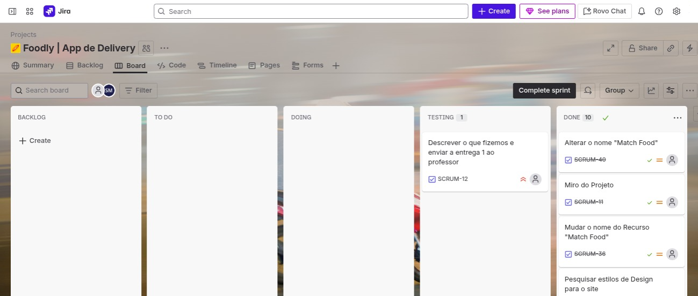
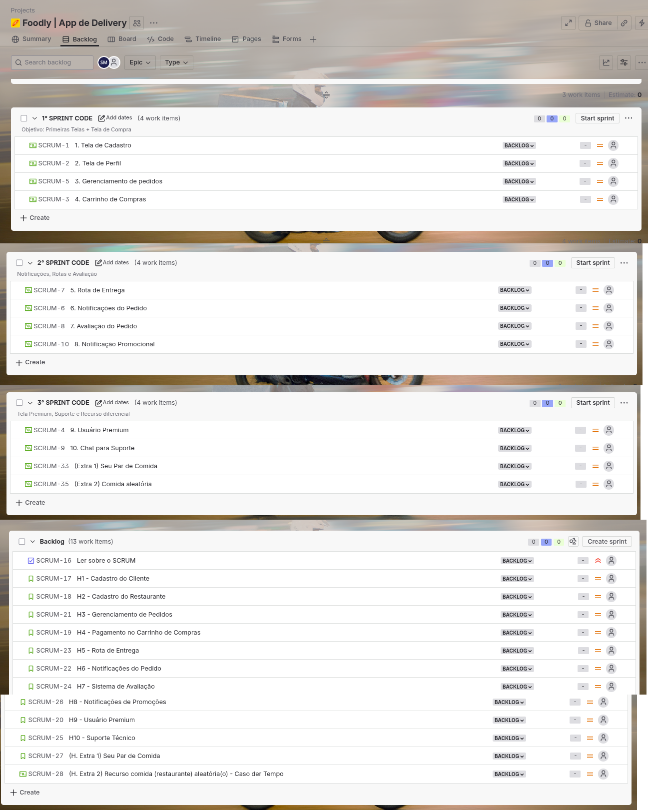

<h1 align="center">
  <br>
  <a href="#"></a>
  <br>
  Foodly
  <br>
</h1>

<h4 align="center">O App de Delivery que leva o que você deseja onde estiver, com apenas um toque.</h4>

<p align="center">
  <a href="#-colaboradores-">
    
    </a>
  </p>

<p align="center">
  <a href="#-shields-">
     
     
     
    
    
    
  </a>
  </p>
  
<p align="center">
  <a href="#cargos">Cargos</a> •
  <a href="#recursos">Recursos</a> •
   <a href="#quadro-scrum">Quadro Scrum</a> •
  <a href="#como-usar?">Como usar?</a> •
  <a href="#download">Download</a> •
  <a href="#creditos">Creditos</a> •
  <a href="#relacionado">Relacionado</a> •
  <a href="#licença">Licença</a>
</p>

<!--

-->


## Cargos:
- Devs Back-end: `Breno / Ivo / Diogo` - Java / Spring  
- Devs Front-end: `Pedro / Salomão` - Javascript / HTML / Tailwind  
- Devs Fullstack: `Nedson / Alvin` - Java / Spring / Javascript / HTML / Tailwind  
- Design: `Pedro / Salomão`


## Recursos - Sprints

1. Cadastro de cliente/Entregador/Restaurante  

2. Cardápio Digital/Perfil Restaurante 

3. Carrinho de compra  

4. Usuário Premium 

5. Painel para o restaurante (Status do pedido)  

6. Painel entregador 

7. Calcular de rota  

8. Avaliação Restaurante/Entregador 

9. Chat suporte  

10. Notificação Promocional 

11. Recurso para fazer seu "Par de Comida"

12. Recurso para recomendar um restaurante/comida aleatória com melhor avaliação

## Quadro Scrum

> [**Link do Jira**](https://projeto-unicap-sistema-delivery.atlassian.net/jira/software/projects/SCRUM/boards/1)

### Usamos o Jira para fazer:




## Telas para o projeto

1. Telas de login/cadastro/cadastro restaurante

[> [**Link do Figma**](https://www.figma.com/design/fk10hlFWE6IKpBmtW9kUEi/Cadastro-user-restaurant?t=g43D6DcT9sHICGxk-0)

2. Tela para Suporte Técnico

[**Link do Figma**](https://www.figma.com/make/pS92vC14a0VCkQw4ji2vtY/Technical-Support-Page?node-id=0-1&p=f&t=yegI2oIWDYobotgQ-0)

3. Tela para o menu principal


5. Tela para usuário e usuário premium


6. Tela para o par de comida


7. Tela para cárdapio


8. Tela acompanhamento de pedido


9. Tela de pedido (Restaurante)


10.
<!-- DEPOIS INCLUIR: --
## Como usar?

To clone and run this application, you'll need [Git](https://git-scm.com) and [Node.js](https://nodejs.org/en/download/) (which comes with [npm](http://npmjs.com)) installed on your computer. From your command line:

```bash
# Clone this repository
$ git clone https://github.com/amitmerchant1990/electron-markdownify

# Go into the repository
$ cd electron-markdownify

# Install dependencies
$ npm install

# Run the app
$ npm start
```

> **Note**
> If you're using Linux Bash for Windows, [see this guide](https://www.howtogeek.com/261575/how-to-run-graphical-linux-desktop-applications-from-windows-10s-bash-shell/) or use `node` from the command prompt.


## Download

You can [download](https://github.com/amitmerchant1990/electron-markdownify/releases/tag/v1.2.0) the latest installable version of Markdownify for Windows, macOS and Linux.

## Emailware

Markdownify is an [emailware](https://en.wiktionary.org/wiki/emailware). Meaning, if you liked using this app or it has helped you in any way, I'd like you send me an email at <bullredeyes@gmail.com> about anything you'd want to say about this software. I'd really appreciate it!

## Creditos

This software uses the following open source packages:

- [Electron](http://electron.atom.io/)
- [Node.js](https://nodejs.org/)
- [Marked - a markdown parser](https://github.com/chjj/marked)
- [showdown](http://showdownjs.github.io/showdown/)
- [CodeMirror](http://codemirror.net/)
- Emojis are taken from [here](https://github.com/arvida/emoji-cheat-sheet.com)
- [highlight.js](https://highlightjs.org/)

## Related

[Try Web version of Markdownify](https://notepad.js.org/markdown-editor/)

## Support

If you like this project and think it has helped in any way, consider buying me a coffee!

<a href="https://buymeacoffee.com/amitmerchant" target="_blank"></a>

## You may also like...

- [Pomolectron](https://github.com/amitmerchant1990/pomolectron) - A pomodoro app
- [Correo](https://github.com/amitmerchant1990/correo) - A menubar/taskbar Gmail App for Windows and macOS

## Licença

MIT

---

> [amitmerchant.com](https://www.amitmerchant.com) &nbsp;&middot;&nbsp;
> GitHub [@amitmerchant1990](https://github.com/amitmerchant1990) &nbsp;&middot;&nbsp;
> Twitter [@amit_merchant](https://twitter.com/amit_merchant)
-->

