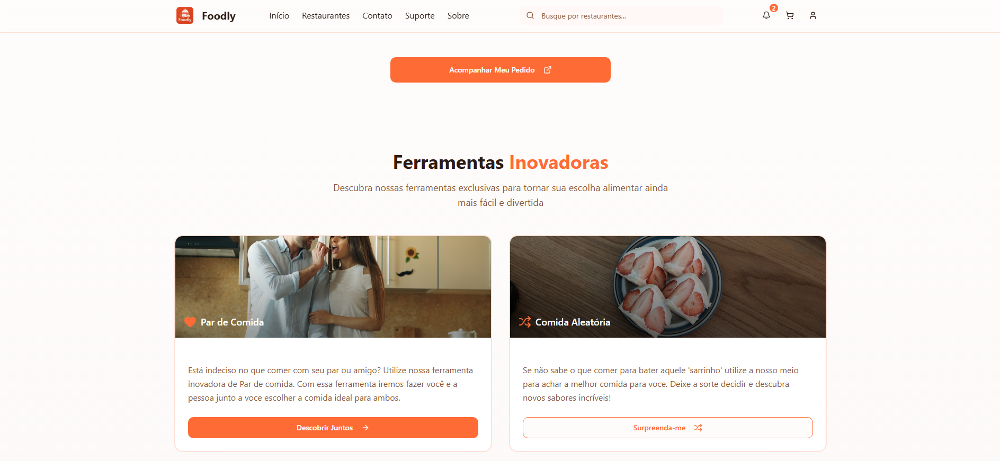
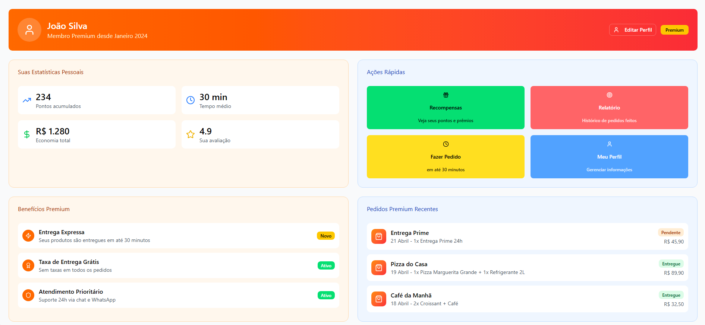
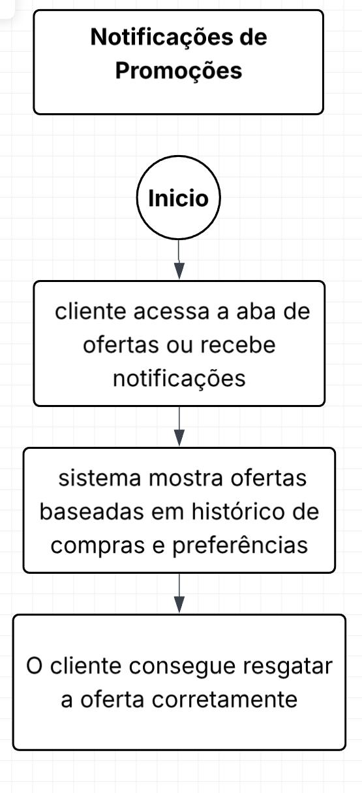
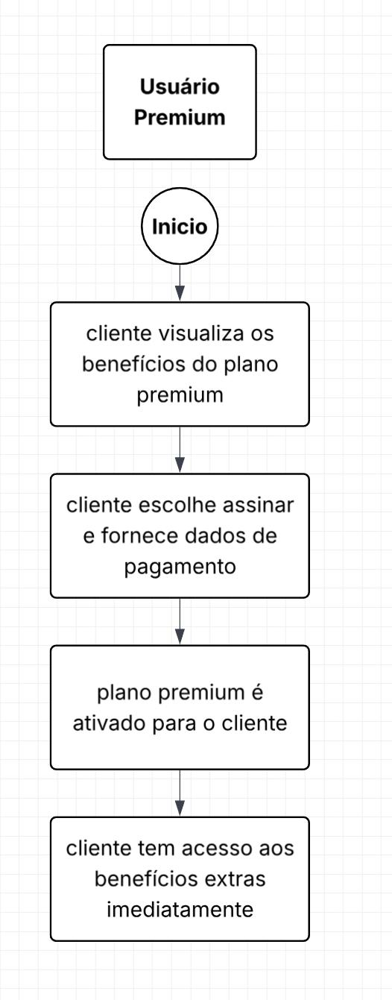
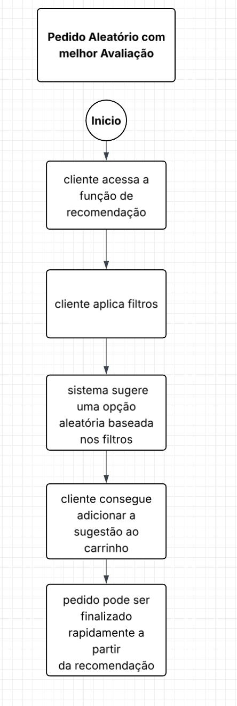

# Links de Entregas Antigas

## 🎯 Quadro Scrum

> [**Link do Jira**](https://projeto-unicap-sistema-delivery.atlassian.net/jira/software/projects/SCRUM/boards/1)

### 📌 Usamos o Jira:

## 🖥️ Telas para o projeto

> [**Link do Figma**](https://www.figma.com/files/team/1550588552907812239/project/454881178/Projeto-de-equipe?fuid=1550588548872029139)
> [**Link do Vídeo**](https://drive.google.com/file/d/1DPRSJO9x1ZPqJQnVmqhCyk8qL_WOP9eo/view?usp=sharing)

1. Telas de login/cadastro/cadastro restaurante

2. Tela para Suporte Técnico

3. Tela para o menu principal

 

5. Tela para usuário e usuário premium

6. Tela para restaurantes

7. Tela para cárdapio

8. Tela de pedido (Restaurante)

9. Tela para rastreamento

10. Tela para avaliação

11. Tela de notificação

12. Tela de carrinho

Extra 1. Seu Par de Comida

Extra 2. Comida aleatória

## 🗓️ Recursos - Sprints

1. Cadastro de cliente/Entregador/Restaurante  

2. Cardápio Digital/Perfil Restaurante 

3. Carrinho de compra  

4. Usuário Premium 

5. Painel para o restaurante (Status do pedido)  

6. Painel entregador 

7. Calcular de rota  

8. Avaliação Restaurante/Entregador 

9. Chat suporte  

10. Notificação Promocional 

11. Recurso para fazer seu "Par de Comida"

12. Recurso para recomendar um restaurante/comida aleatória com melhor avaliação

## 🐞 Bug Tracking Fotos

## Fluxo BPMN

> [Link do Fluxo](https://fluxo-bpmn.netlify.app/)

## Diagramas 

- Diagrama H1:  

- Diagrama H2:  

- Diagrama H3:  

- Diagrama H4:  

- Diagrama H5:  
  
- Diagrama H6:  

- Diagrama H7:  

- Diagrama H8:  

- Diagrama H9:  

- Diagrama H10:  

- Diagrama HEX1:  

- Diagrama HEX2:  

